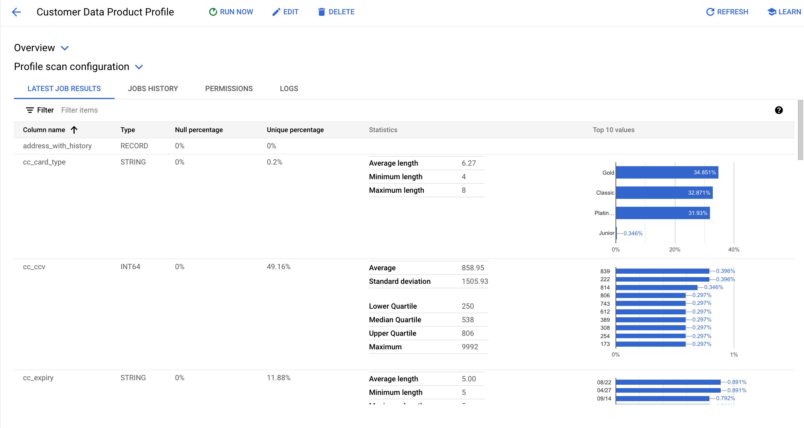
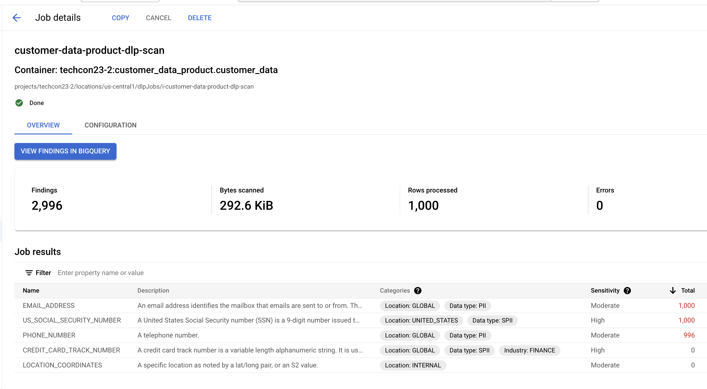
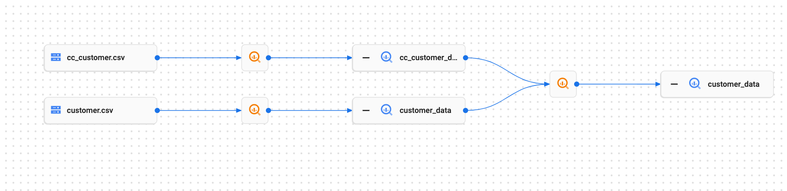

# dataplex-qwiklabs

# Learning Objective

For field engineers to gain hands-on experience in securing and governing data in Bigquery data warehouse, which includes hands-on practice with the following features using a 90-minute lab. 
- Dataset-level security controls
- Column-level security using Policy Tags
- Row-level Security
- Data Classification and tagging
- Data Profiling and Quality assessment  
- Data Lineage 
- Harvesting and ingesting technical and business metadata

## 1. Load the customer data product

```
INSERT INTO
  `techcon23-2.customer_data_product.customer_data`
SELECT
  customer_data.client_id AS client_id,
  ssn AS ssn,
  first_name AS first_name,
  NULL AS middle_name,
  last_name AS last_name,
  dob AS dob,
    gender,
  [STRUCT('current' AS status,
    customer_data.street AS street,
    customer_data.city,
    customer_data.state,
    customer_data.zip AS zip_code,
    ST_GeogPoint(customer_data.latitude,
      customer_data.longitude) AS WKT,
    NULL AS modify_date)] AS address_with_history,
  [STRUCT(customer_data.phonenum AS primary,
    NULL AS secondary,
    NULL AS modify_date)] AS phone_num,
  [STRUCT('current' AS status,
    customer_data.email AS primary,
    NULL AS secondary,
    NULL AS modify_date)] AS email,
    token as token, 
    current_date() as ingest_date, 
  cc_number AS cc_number,
   cc_expiry AS cc_expiry,
   cc_provider AS cc_provider, 
   cc_ccv AS cc_ccv, 
   cc_card_type AS cc_card_type
    FROM
      `techcon23-2.customer_refined_data.customer_data` customer_data
      inner join 
      `techcon23-2.customer_refined_data.cc_customer_data` cc_customer_data
      ON
      customer_data.client_id=cc_customer_data.client_id
```

## 2. Dataset level security

### 2.1 Setup Cloud Logging Sink 

- **Step 1:**  Create the Cloud Logging sink to capture the Dataplex Audit logs into a BigQuery table.
 In Cloud shell, run the below command-

 ```
 export PROJECT_ID=$(gcloud config get-value project)

gcloud logging --project=${PROJECT_ID} sinks create audits-to-bq bigquery.googleapis.com/projects/${PROJECT_ID}/datasets/central_audit_data --log-filter='resource.type="audited_resource" AND resource.labels.service="dataplex.googleapis.com" AND protoPayload.serviceName="dataplex.googleapis.com"'
 ```

- **Step 2:** Validate: Go to Cloud Logging -> Logs Router and you should see a sink called “audits-to-bq” as shown below

- **Step 3:** Capture the  Cloud Logging Sink Service Account 
```
export PROJECT_ID=$(gcloud config get-value project)

LOGGING_GMSA=`gcloud logging sinks describe audits-to-bq | grep writerIdentity | grep serviceAccount | cut -d":" -f3`

echo $LOGGING_GMSA

```
- **Step 4:**  Go to BigQuery console UI -> Select the "central_audit_data" dataset -> Click on **+Sharing ** -> Click on Permissions -> Click on "Add Principal" -> Enter the above copied Logging serviceAccount as the principle and assign the "BigQuery Data Editor" role-> click on "Save" 

### 2.2 Setup the customer service account access 

- **Step 1:** Pre-validation <br>

   Grant yourself the  Service Account Token Creator role for impersonation. 

   ```
    export PROJECT_ID=$(gcloud config get-value project)
    export YOUR_USER_PRINCIPAL_NAME=`gcloud auth list --filter=status:ACTIVE --format="value(account)"`

    gcloud projects add-iam-policy-binding $PROJECT_ID \
    --member=user:${YOUR_USER_PRINCIPAL_NAME} --role=roles/iam.serviceAccountTokenCreator
   ```

   Wait for a couple of minutes for the role to reflect in IAM. 

    Open Cloud shell and execute the below command to list the tables in the "customer_raw_zone" dataset

    ``` 
    export PROJECT_ID=$(gcloud config get-value project)

    export USER_ID="customer-sa"

    curl -X \
    GET -H \
    "Authorization: Bearer $(gcloud auth print-access-token --impersonate-service-account=${USER_ID}@${PROJECT_ID}.iam.gserviceaccount.com)" -H \
    "Content-Type: application.json"  https://bigquery.googleapis.com/bigquery/v2/projects/${PROJECT_ID}/datasets/customer_refined_data/tables?maxResults=10
    ```

    You will receive a "PERMISSION_DENIED" meesage. Sample Output
    ```
    {
  "error": {
    "code": 403,
    "message": "Access Denied: Dataset techcon23-2:customer_refined_data: Permission bigquery.tables.list denied on dataset techcon23-2:customer_refined_data (or it may not exist).",
    "errors": [
      {
        "message": "Access Denied: Dataset techcon23-2:customer_refined_data: Permission bigquery.tables.list denied on dataset techcon23-2:customer_refined_data (or it may not exist).",
        "domain": "global",
        "reason": "accessDenied"
      }
    ],
    "status": "PERMISSION_DENIED"
  }
}```

- **Step 2:** Security policy application <br>

    In Dataplex, let's grant the customer user managed service account, access to the “Consumer Banking - Customer Domain” (lake). For this we will use the Lakes Permission feature to apply policy. 

    1. Go to **Dataplex** in the Google Cloud console.
    2. On the left navigation bar, click on **Manage** menu under **Manage Lakes**.
    3. Click on the **“Consumer Banking - Customer Domain”** lake.
    4. Click on the "**PERMISSIONS**" tab.
    5. Click on **+GRANT ACCESS**
    6. Choose **“customer-sa@your-project-id.iam.gserviceaccount.com”**  as principal
    7. Assign **Dataplex Data Owner** role.
    8. Click the **save** button
    9. Verify Dataplex data owner roles appear under the permissions 

- **Step 4**: Post-Validation<br>

    After the access policies has been propagated by Dataplex, rerun the commands in Step1 and verify the service account is able to access underlying data

    Open Cloud shell and execute the below command which should now execute successfully. 

    ```bash 
    export PROJECT_ID=$(gcloud config get-value project)

    export USER_ID="customer-sa"

    curl -X \
    GET -H \
    "Authorization: Bearer $(gcloud auth print-access-token --impersonate-service-account=${USER_ID}@${PROJECT_ID}.iam.gserviceaccount.com)" -H \
    "Content-Type: application.json"  https://bigquery.googleapis.com/bigquery/v2/projects/${PROJECT_ID}/datasets/customer_refined_data/tables?maxResults=10
    ```
    
    Sample Output:

    ```
    WARNING: This command is using service account impersonation. All API calls will be executed as [customer-sa@techcon23-2.iam.gserviceaccount.com].
    {
  "kind": "bigquery#tableList",
  "etag": "+rJk7OpcCM/K1wa6+RTzLg==",
  "tables": [
    {
      "kind": "bigquery#table",
      "id": "techcon23-2:customer_refined_data.cc_customer_data",
      "tableReference": {
        "projectId": "techcon23-2",
        "datasetId": "customer_refined_data",
        "tableId": "cc_customer_data"
      },
      "type": "TABLE",
      "creationTime": "1682021707441"
    },
    {
      "kind": "bigquery#table",
      "id": "techcon23-2:customer_refined_data.customer_data",
      "tableReference": {
        "projectId": "techcon23-2",
        "datasetId": "customer_refined_data",
        "tableId": "customer_data"
      },
      "type": "TABLE",
      "creationTime": "1682021707609"
    }
  ],
  "totalItems": 2
}
    ``` 


### 2.3 Analyze Dataplex Audit Data  

Go to BigQuery and perform analysis on the audit data to analyze and report 

 - Open BigQuery UI, change the processing location to us-central1 and execute the below query after replacing the ${PROJECT_ID}
    ```bash 
    SELECT protopayload_auditlog.methodName,   protopayload_auditlog.resourceName,  protopayload_auditlog.authenticationInfo.principalEmail,  protopayload_auditlog.requestJson, protopayload_auditlog.responseJson FROM `${PROJECT_ID}.central_audit_data.cloudaudit_googleapis_com_activity_*` LIMIT 1000
    ```

## 3. Setting up Column Level Security 

In this step we will restrict the access to the SSN column for users and also apply Data Masking rules. 

| Sevice Account  | Access Type |
| ------------- | ------------- |
| cls-pii-noaccess  | No access to the SSN column  |
| cls-pii-null  | Receive "null" for SSN column  |
| cls-pii-lastfour  | Receive hash (SHA256) for SSN column  |
<br> 

### 3.1.1 Define a Policy Taxonomy 

1. Go to **Dataplex** in the Google Cloud console.
2. On the left navigation bar, click on **Policy Tags** menu under **Manage Catalog**.
3. Click on **+ CREATE TAXONOMY** 
4. Provide **Business Critical** as Taxonomy name 
5. Choose **us-central1** as the Location. **This is critical**
6. Enter **High** as Policy tag name
7. Click **+ADD SUBTAG**
8. Enter **SSN** as Policy tag name
9. Click on **CREATE**
10. Expand on **High** under the Policy Tags 
11. Select the **SSN** by clicking on the checkbox to the left 
12.  Click on **MANAGE DATA POLICIES**
13. Click on **+ADD RULE**
14. Enter **ssn_nul** as Data Policy Name 1
15. Choose **Nullify" as Masking Rule 1
16. Enter **cls-pii-null@project-id.iam.gserviceaccount.com** as Principal 1. Make sure you choose from drop down where your project id is replaced
17. Click on **+ ADD RULE** 
18. Enter **ssn_lastfour** as Data Policy Name 2
19. Choose **Hash (SHA256)** 
20. Enter **cls-pii-lastfour@project-id.iam.gserviceaccount.com** as Principal 1. Make sure you choose from drop down where your project id is replaced
21. Click on "Submit"

### 3.1.2 Apply the Policy Tag to the customer data 

1. Go to BigQuery UI in Cloud Console 
2. Go to the **customer_data** table under the **customer_refined_data** dataset 
3. Go to the **SCHEMA** tab and click on **Edit Schema**
4. Select the **ssn** by clicking on the checkbox left to it
5. Click on **ADD POLICY TAG** 
6. Expand on **Business Critical** and then choose **ssn**
7. Click **Select**
8. Click **Save**

### 3.1.2 Validate the No access to the SSN column for cls-pii-noaccess SA

Go to gcloud shell and execute the below commands

```  
export PROJECT_ID=$(gcloud config get-value project)

export USER_ID="cls-pii-noaccess"

export QUERY="Select ssn from customer_refined_data.customer_data limit 10"

curl --silent -X \
    POST -H \
    "Authorization: Bearer $(gcloud auth print-access-token --impersonate-service-account=${USER_ID}@${PROJECT_ID}.iam.gserviceaccount.com)" -H \
    "Content-Type: application.json"  https://bigquery.googleapis.com/bigquery/v2/projects/${PROJECT_ID}/queries --data "{\"query\":\"${QUERY}\" , \"useLegacySql\":\"false\"}"

```
Expected Output

```
{
  "error": {
    "code": 403,
    "message": "Access Denied: BigQuery BigQuery: User has neither fine-grained reader nor masked get permission to get data protected by policy tag \"Business Critical : ssn\" on column customer_refined_data.customer_data.ssn.",
    "errors": [
      {
        "message": "Access Denied: BigQuery BigQuery: User has neither fine-grained reader nor masked get permission to get data protected by policy tag \"Business Critical : ssn\" on column customer_refined_data.customer_data.ssn.",
        "domain": "global",
        "reason": "accessDenied"
      }
    ],
    "status": "PERMISSION_DENIED"
  }
}
```

### 3.1.2 Validate the null  access to the SSN column for cls-pii-null SA
Go to gcloud shell and execute the below commands

```
export PROJECT_ID=$(gcloud config get-value project)

export USER_ID="cls-pii-null"

export QUERY="Select ssn from customer_refined_data.customer_data limit 5"

curl --silent -X \
    POST -H \
    "Authorization: Bearer $(gcloud auth print-access-token --impersonate-service-account=${USER_ID}@${PROJECT_ID}.iam.gserviceaccount.com)" -H \
    "Content-Type: application.json"  https://bigquery.googleapis.com/bigquery/v2/projects/${PROJECT_ID}/queries --data "{\"query\":\"${QUERY}\" , \"useLegacySql\":\"false\"}" |  jq -r '.rows[] | .f[].v'

```

Expected Output: 

```
null
null
null
null
null
```

### 3.1.2 Validate the null  access to the SSN column for cls-pii-lastfour SA

Go to gcloud shell and execute the below commands

```
export PROJECT_ID=$(gcloud config get-value project)

export USER_ID="cls-pii-lastfour"

export QUERY="Select ssn from customer_refined_data.customer_data limit 5"

curl --silent -X \
    POST -H \
    "Authorization: Bearer $(gcloud auth print-access-token --impersonate-service-account=${USER_ID}@${PROJECT_ID}.iam.gserviceaccount.com)" -H \
    "Content-Type: application.json"  https://bigquery.googleapis.com/bigquery/v2/projects/${PROJECT_ID}/queries --data "{\"query\":\"${QUERY} \" , \"useLegacySql\":\"false\"}" |  jq -r '.rows[] | .f[].v'

```

Expected Output: 
```
XXXXX8429
XXXXX5665
XXXXX0048
XXXXX6923
XXXXX3810
```

## 4. Setting up Row Level Security 

### 4.1. Create Row Access Policies 

1. Go to BigQuery console 

2. Execute the below queries after replacing with your project id
```
CREATE ROW ACCESS POLICY 
ca_filter
ON
 `**project-id**.customer_refined_data.customer_data`
 GRANT TO 
 ('serviceAccount:rls-user1@**project-id**.iam.gserviceaccount.com')
 FILTER USING 
 (State="CA")
```

```
CREATE ROW ACCESS POLICY 
ny_filter
ON
 `**project-id**.customer_refined_data.customer_data`
 GRANT TO 
 ('serviceAccount:rls-user2@**project-id**.iam.gserviceaccount.com')
 FILTER USING 
 (State="NY")
```
3. Go to Cloud Shell and execute the below command

```
export PROJECT_ID=$(gcloud config get-value project)

export USER_ID="rls-user1"

export QUERY="Select state from customer_refined_data.customer_data where state='CA' limit 5"

curl --silent -X \
    POST -H \
    "Authorization: Bearer $(gcloud auth print-access-token --impersonate-service-account=${USER_ID}@${PROJECT_ID}.iam.gserviceaccount.com)" -H \
    "Content-Type: application.json"  https://bigquery.googleapis.com/bigquery/v2/projects/${PROJECT_ID}/queries --data "{\"query\":\"${QUERY} \" , \"useLegacySql\":\"false\"}" |  jq -r '.rows[] | .f[].v'
```
Try to read for another state 


```
export PROJECT_ID=$(gcloud config get-value project)

export USER_ID="rls-user1"

export QUERY="Select state from customer_refined_data.customer_data where state='NY' limit 5"

curl --silent -X POST -H     "Authorization: Bearer $(gcloud auth print-access-token --impersonate-service-account=${USER_ID}@${PROJECT_ID}.iam.gserviceaccount.com)" -H     "Content-Type: application.json"  https://bigquery.googleapis.com/bigquery/v2/projects/${PROJECT_ID}/queries --data "{\"query\":\"${QUERY} \" , \"useLegacySql\":\"false\"}"|  jq -r '.rows[] | .f[].v'
```

Expected outcome
```
jq: error (at <stdin>:20): Cannot iterate over null (null)
```

```
export PROJECT_ID=$(gcloud config get-value project)

export USER_ID="rls-user2"

export QUERY="Select state from customer_refined_data.customer_data where state='NY' limit 5"

curl --silent -X POST -H     "Authorization: Bearer $(gcloud auth print-access-token --impersonate-service-account=${USER_ID}@${PROJECT_ID}.iam.gserviceaccount.com)" -H     "Content-Type: application.json"  https://bigquery.googleapis.com/bigquery/v2/projects/${PROJECT_ID}/queries --data "{\"query\":\" ${QUERY}\" , \"useLegacySql\":\"false\"}" |  jq -r '.rows[] | .f[].v'
```

Expected Output: 
```
NY
NY
NY
NY
NY
```

##  5. Data Profiling 
1. Go to **Dataplex** in the Google Cloud Console 
2. Click on the left navigation menu and click on **Profile** under Govern
3. Click on **+ CREATE DATA PROFILE SCAN** 
4. Provide **customer-data-product-profile** as Id
5. Click on **BROWSE** under Table to scan
6. Choose **Customer_data** under **Customer Data Product Zone** 
7.  Choose **Entire data** as scope 
8. Choose **On-demand** as schedule option 
9. Click on **RUN SCAN**
10. It will take 2-3 minutes to finish. Watch the notification for tracking the creation **Created and ran datascan "Customer Data product Profile"**
11. Click on the ** CUSTOMER DATA PRODUCT PROFILE** job 
12. Scroll down to look at the **LATEST JOB RESULTS** 




## 6. Auto Data Quality
1. Go to **Dataplex** in the Google Cloud Console 
2. Click on the left navigation menu and click on **Data Quality** under Govern
3. Click on **+ CREATE DATA QUALITY SCAN** 
4. Provide **Customer Data Product Quality** 
5. Click on **BROWSE** under Table to scan
6. Choose **Customer_data** under **Customer Data Product Zone** 
7.  Choose **Entire data** as scope 
8. Click on **CONTINUE**
9. Click on **ADD RULE** 
10. Clieck on profile based recommendations and choose a set of rules as applicable 
11. Click on **Select** 
12. Click on **ADD Rules**
13. Select **Built-in types** 
14. Select **gender, ssn, client_id** as a column 
15. Choose **NULL check, Value-set check, Uniqueness check** as rule type
16. Select **Client_id - Null check**
17. Select **gender - Value Set check**
18. Select **ssn - uniqueness check**
19. Click on the edit button next to **gender - Value set Check Rule** 
20. Click **ADD VALUE** 
21. Add 3 values - F, M, NB
22. Click on **ADD RULE**
23. Select **SQL aggregrate check rule**
24. Choose **Freshness** as the dimension
25. Choose **ingest_date** as the Column name
26. Enter this as the sql rule - "max(ingest_date)>= date_sub(current_date(), interval 1 day)"
27. Click **Add**
18. Click **Save** 
29. Click on **Continue**
30. Choose **On-demand** as schedule 
31. Click on **CREATE**
32. Click on the **Customer data product quality** job 
33. Click **RUN NOW**
34. Wait fot a couple of minutes and refresh the screen 


##  7. Data Classification and Tagging 
1. Go to DLP service 
2. Go to the **inspection** tab 
3. Click on **CREATE JOB AND JOB TRIGGERS**
4. Provide **customer-data-product-dlp-scan** 
5. Choose **Iowa(us-central1)** as resource location 
6. Choose **Bigquery** as Storage type 
7. Provide your project id 
8. Enter **customer_data_product** as Dataset 
9. Enter **customer_data** as table name 
10. Provide the below info types 
    - US_SOCIAL_SECURITY_NUMBER
    - CREDIT_CARD_TRACK_NUMBER
    - CREDIT_CARD_NUMBER
    - LOCATION_COORDINATES
    - EMAIL_ADDRESS
    - PHONE_NUMBER
11. Click **Continue**
12. Activate **Save to BigQuery** 
13.  Provide your Project id 
14. Enter **central_dlp_data** as Dataset 
15. Enter **dlp_profile** as tablename 
16. Choose **Publish to Dataplex** 
17. Choose None as schedule
18. Click Create


19. Go to Dataple Search 
20. Search for "tag:data_loss_prevention"
21. Click on the entry 


## 8. Business Metadata Enrichment 

### 8.1 Add Business Overview 

Execute the below command in gCloud

```
export PROJECT_ID=$(gcloud config get-value project)

entry_name=`curl -X GET -H "x-goog-user-project: ${PROJECT_ID}" -H  "Authorization: Bearer $(gcloud auth print-access-token)" -H "Content-Type: application.json" "https://datacatalog.googleapis.com/v1/entries:lookup?linkedResource=//bigquery.googleapis.com/projects/${PROJECT_ID}/datasets/customer_data_product/tables/customer_data&fields=name" | jq -r '.name'`

curl -X POST -H "x-goog-user-project: d${PROJECT_ID}" -H  "Authorization: Bearer $(gcloud auth print-access-token)" -H "Content-Type: application.json" https://datacatalog.googleapis.com/v1/${entry_name}:modifyEntryOverview -d "{\"entryOverview\":{\"overview\":\"  <div class='ping' style='width:2000px;text-align: left;' ></div><header><h1>&#128508; Customer Demograhics Data Product</h1></header><br>This customer data table contains the data for customer demographics of all Bank of Mars retail banking customers. It contains PII information that can be accessed on need-to-know basis. <br> Customer data is the information that customers give us while interacting with our business through websites, applications, surveys, social media, marketing initiatives, and other online and offline channels. A good business plan depends on customer data. Data-driven businesses recognize the significance of this and take steps to guarantee that they gather the client data points required to enhance client experience and fine-tune business strategy over time.\"}}"
```


### 8.2 Add Business Tag Programatically  
1.  Open Cloud Shell and create a new file called “customer-tag.yaml” and copy and paste the below yaml into a file.

    ```bash 
    cd ~
    vim customer-tag.yaml
    ``` 
    Enter the below text 
    ```
    data_product_id: derived
    data_product_name: ""
    data_product_type: ""
    data_product_description: ""
    data_product_icon: ""
    data_product_category: ""
    data_product_geo_region: ""
    data_product_owner: ""
    data_product_documentation: ""
    domain: derived
    domain_owner: ""
    domain_type: ""
    last_modified_by: ""
    last_modify_date: ""
    ```

    **Make sure you always leave the last_modified_by and last _moddify date blank**

2. Upload the file to the temp gcs bucket

```bash 
export PROJECT_ID=$(gcloud config get-value project)

gsutil cp ~/customer-tag.yaml gs://${PROJECT_ID}_dataplex_temp/
```

3. Run the below command to create the tag for customer_data product entity 

```bash 
gcloud dataplex tasks create customer-tag-job \
        --project=${PROJECT_ID} \
        --location=us-central1 \
        --vpc-sub-network-name=projects/${PROJECT_ID}/regions/us-central1/subnetworks/dataplex-default \
        --lake='consumer-banking--customer--domain' \
        --trigger-type=ON_DEMAND \
        --execution-service-account=customer-sa@${PROJECT_ID}.iam.gserviceaccount.com \
        --spark-main-class="com.google.cloud.dataplex.templates.dataproductinformation.DataProductInfo" \
        --spark-file-uris="gs://${PROJECT_ID}_dataplex_temp/customer-tag.yaml" \
        --container-image-java-jars="gs://${PROJECT_ID}_dataplex_process/common/tagmanager-1.0-SNAPSHOT.jar" \
        --execution-args=^::^TASK_ARGS="--tag_template_id=projects/${PROJECT_ID}/locations/us-central1/tagTemplates/data_product_information, --project_id=${PROJECT_ID},--location=us-central1,--lake_id=consumer-banking--customer--domain,--zone_id=customer-data-product-zone,--entity_id=customer_data,--input_file=customer-tag.yaml"

```

4. Go to Dataplex UI and then Process to monitor the tagging job. 

5. Once the job completes successfully. Go to **Dataplex** UI and search using **tag:data_product_information**

6. Update the YAML, re-upload to gcs and re-run job to see the change reflect in the tag programatically. 

## 9. Data Lineage 
1.For the same customer_data, Click on the Lineage tab to explore data lineage


